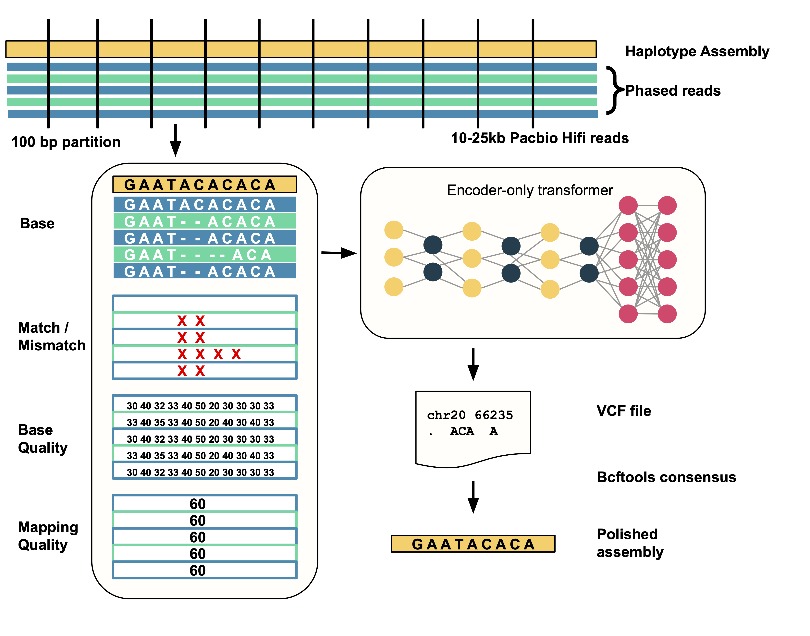

# DeepPolisher

DeepPolisher is a transformer-based sequencing correction method similar to
DeepConsensus. DeepPolisher is designed to identify errors in genome assemblies.
DeepPolisher takes haplotype-specific reads aligned to phased assemblies and
produces a VCF file containing potential errors in the assembly. Currently,
DeepPolisher can take PacBio HiFi-based assemblies and read alignments to
identify potential errors.

Please see the [case study of DeepPolisher](docs/case_study.md) for
step-by-step instructions on how to polish an assembly.

## How it works

DeepPolisher works in two steps:

* `make_images`: In make images step,
DeepPolisher looks at the reads aligned to the assembly and creates tensor-like
examples of region with potential assembly errors. It encoded several features
of the region including read bases, base quality, mapping quality, match or
mismatch.
* `inference`: In inference step, the examples from the previous step
is passed to a transformer model that predicts a sequence for the region. The
predicted sequence is compared against the assembly sequence and any observed
difference is recorded as a potential error and reported in the VCF.

A diagram on how DeepPolisher works is presented here:

<p align="center">
    
</p>

## Input and output

Input:
DeepPolisher takes two primary inputs:

* A haplotype-specific genome assembly generated using PacBio HiFi reads.
This can be generated with assemblers like [Verkko](https://github.com/marbl/verkko)
or [HiFiasm](https://github.com/chhylp123/hifiasm).
* Haplotype-specific PacBio HiFi reads aligned to corresponding to the input
assembly. This can be generated using HPRC's [PHARAOH pipeline](https://github.com/miramastoras/hpp_production_workflows/blob/master/QC/wdl/workflows/PHARAOH.wdl).

Output:

* The output of DeepPolisher is a VCF file that contains potential errors
in the assembly.

Currently, DeepPolisher only works on PacBio HiFi assembly and reads.

## How was the model trained?

The current release model of DeepPolisher was trained to polish HG002 HiFiasm
v0.19.5 diploid assembly generated with PacBio HiFi data. The reads were phased
with [PHARAOH pipeline](https://github.com/miramastoras/hpp_production_workflows/blob/master/QC/wdl/workflows/PHARAOH.wdl).
We took HG002 T2T v0.9 assembly as the truth for maternal and paternal contigs
and projected high-confidence blocks of genome-in-a-bottle and trained only on
the regions that can be confidently mapped between assemblies. The current model
can only work on PacBio HiFi assembly and read data. For training, we trained
on contigs that map to chr1-chr19 of the truth, used chr21-chr22 for tune and
completely held out chr20 for evaluation.

## How to install DeepPolisher

You can either use Docker container to run DeepPolisher or install using pip.
### How to use docker

The docker is available using:

```bash
sudo docker pull google/deepconsensus:polisher_v0.1.0
```

### How to install using pip
Setup pip:

```bash
sudo -H apt-get -qq -y update
sudo -H apt-get -y install python3-dev python3-pip
sudo -H apt-get -y update
python3 -m pip install --upgrade pip
```

Setup virtual environment:

```bash
sudo apt install python3-venv
python3 -m venv ~/workspace/polisher-venv/
source ~/workspace/polisher-venv/bin/activate

# This activates the virtual env
echo "$(pip --version)"
```

Install requirements:

```bash
# For pysam
export HTSLIB_CONFIGURE_OPTIONS=--enable-plugins
pip install -r requirements.txt
```

Install DeepPolisher:

```bash
pip install .[cpu]
```

Check installation:

```bash
polisher --version
> 0.1.0

which polisher
> /path/to/workspace/polisher-venv/bin/polisher
```

### Prerequisites

*   Unix-like operating system (cannot run on Windows)
*   Python 3.8

## Contribution Guidelines

Please [open a pull request](https://github.com/google/deeppolisher/compare) if
you wish to contribute to DeepPolisher. Note, we have not set up the
infrastructure to merge pull requests externally. If you agree, we will test and
submit the changes internally and mention your contributions in our
[release notes](https://github.com/google/deeppolisher/releases). We apologize
for any inconvenience.

If you have any difficulty using DeepPolisher, feel free to
[open an issue](https://github.com/google/deeppolisher/issues/new). If you have
general questions not specific to DeepPolisher, we recommend that you post on a
community discussion forum such as [BioStars](https://www.biostars.org/).

## Acknowledgements

We thank Mira Mastoras, Mobin Asri and Benedict Paten from the Genomics
Institute at University of California, Santa Cruz for providing critical
feedback and evaluation on the performance of DeepPolisher. We also thank Mira
Mastoras for the image describing how DeepPolisher works presented in this page.

## License

[BSD-3-Clause license](LICENSE)

## Disclaimer

This is not an official Google product.

NOTE: the content of this research code repository (i) is not intended to be a
medical device; and (ii) is not intended for clinical use of any kind, including
but not limited to diagnosis or prognosis.
